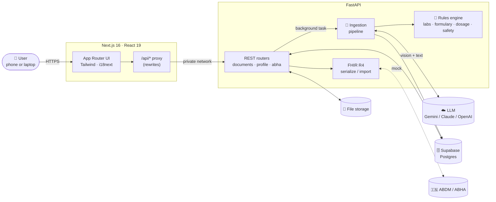
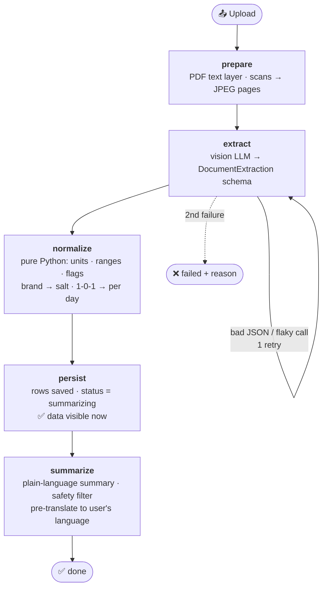
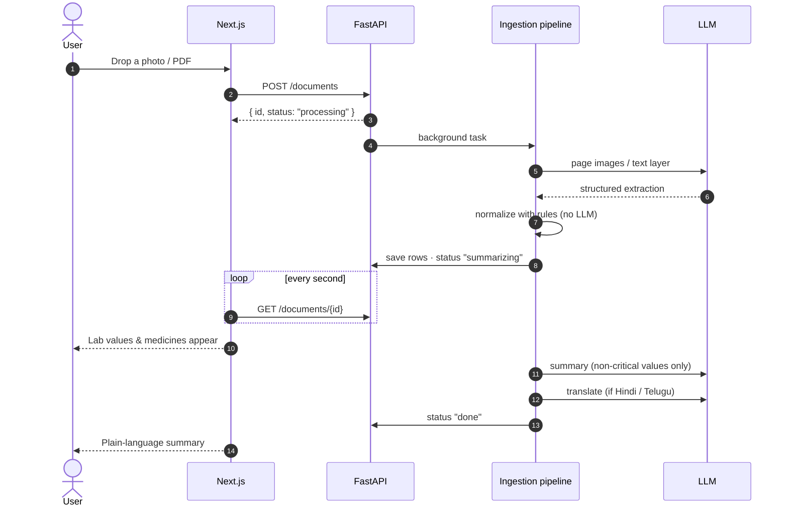
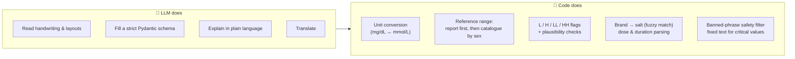
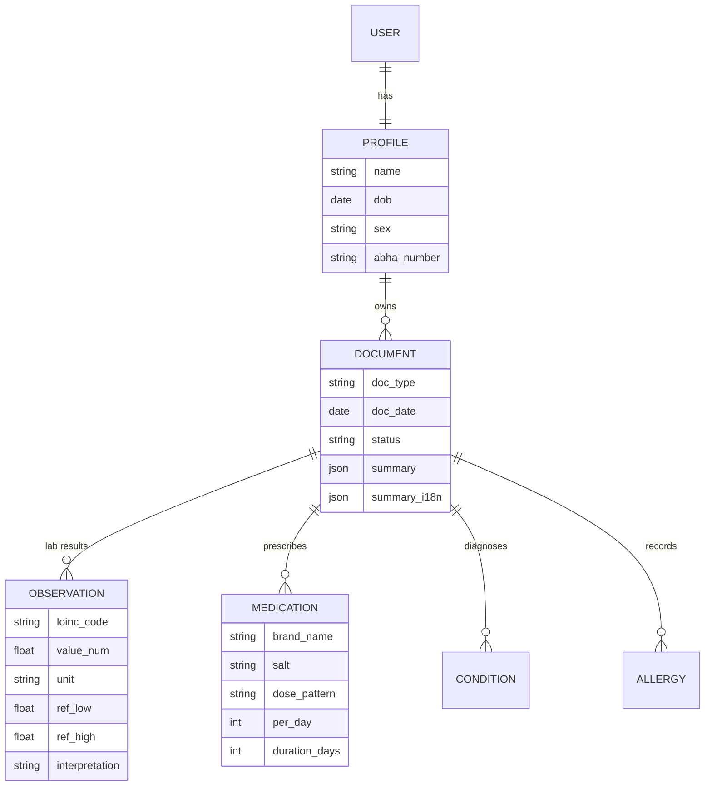

<div align="center">

# 🩺 AI-Powered Personal Health Copilot

**Your medical records, finally readable.**

Snap a prescription, lab report or discharge summary → get the data extracted, every value checked,
and a calm plain-language explanation in **English, हिन्दी or తెలుగు** — all in one timeline,
exportable as **FHIR** and ready for India's **ABHA / ABDM** ecosystem.


</div>

---

## 💡 Why this exists

Medical paperwork in India is messy: handwritten prescriptions, `1-0-1` dose codes, bilingual lab
reports, reference ranges that change from lab to lab, and records scattered across clinics. Most
people can't tell whether a value is fine or worrying, and they lose track of what they're taking.

Health Copilot turns that pile of paper into something you can understand and carry with you:

| Problem | How the Copilot helps |
|---|---|
| "What does this report even say?" | Reads photos, scans and PDFs — printed, handwritten or bilingual |
| "Is this value bad?" | Flags **Low / High / Critical** using the lab's own range, or a curated catalogue — computed in code, never guessed by the AI |
| "What is Dolo-650 and how do I take it?" | Maps brands to salts and turns `1-0-1 x 5d` into *morning & night, for 5 days* |
| "I don't read English medical jargon" | Explains everything in simple English, Hindi or Telugu |
| "My records are everywhere" | One profile and timeline across every document, plus FHIR export and ABHA import |

> ⚠️ The Copilot explains records; it **never** diagnoses, prescribes or tells anyone to change a dose.

---

## ✨ Features

- 📸 **Upload anything** — JPG, PNG or PDF (up to 15 MB), straight from the phone camera
- 🧠 **Vision-LLM extraction** into a strict schema: medicines, lab results, diagnoses, allergies, dates
- 🧮 **Deterministic accuracy layer** — units, reference ranges, abnormal flags and dose parsing are plain Python
- 🚨 **Critical-value guard** — dangerous values get a fixed "contact a doctor promptly" message, not AI prose
- 🛡️ **Safety filter** — summaries are scanned for banned wording ("you have…", "stop taking…", "cure") and regenerated
- 🌐 **Multilingual** UI and summaries (English / Hindi / Telugu), translated ahead of time in your chosen language
- 📈 **Profile & timeline** — current medicines, conditions, allergies and out-of-range results at a glance
- 🔗 **ABHA linking + FHIR R4** export and import (ABDM mocked for the demo)
- ⚡ **Fast feedback** — extracted data appears as soon as it's read; the summary follows right after
- 🔌 **Any LLM** — Gemini out of the box; Claude or OpenAI with one `provider:model` setting and their LangChain package
- 🌙 Dark mode, print-friendly pages, accessible status badges (icon + text, never colour alone)

---

## 📄 Sample documents to try

No medical records of your own? `backend/eval/gold/` has 6 ready-to-upload documents, each with a
hand-checked label file (`.json`):

| File | What it is | What it tests |
|---|---|---|
| `cbc_report.pdf` | Blood count report | Low haemoglobin, platelets in lakhs/cumm |
| `kft_critical.pdf` | Kidney panel + sugar | **Critical** potassium (6.8) → fixed safety message |
| `lipid_thyroid_scan.jpg` | Lipid + thyroid report, phone-photo style | Vision path: tilt, blur, noise |
| `diabetes_prescription.pdf` | Printed prescription | `1-0-1` dose codes, combination brands, allergy |
| `fever_prescription_bilingual.jpg` | Hindi / English prescription | Hindi instructions (खाने के बाद) |
| `dengue_discharge_summary.pdf` | Hospital discharge summary | Admission/discharge dates, SOS dosing |

All six are synthetic (fictional patients, clinics and doctors), generated with
`python -m eval.make_samples`.

---

## 🏗️ Architecture



The browser only ever talks to the Next.js app; it forwards `/api/*` to FastAPI, so a single public URL
serves everything and no CORS setup is needed.

---

## ⚙️ How it works

### The ingestion pipeline

Every upload runs through five plain Python steps in a background task:



### What happens when you upload



### Where accuracy comes from

The LLM is used only for what it's good at — **reading** and **explaining**. Everything that must be
exactly right is deterministic, testable Python:



### Data model (FHIR-shaped)



Tables map directly onto FHIR resources (Patient, DocumentReference/Composition, Observation,
MedicationRequest, Condition, AllergyIntolerance), so export and import are thin.

---

## 🧰 Tech stack

| Layer | Technology | Why |
|---|---|---|
| **Frontend** | Next.js 16 (App Router), React 19, TypeScript | Routing, production server and the `/api` proxy |
| | Tailwind CSS 4, i18next | Design tokens with dark mode; English / Hindi / Telugu |
| **API** | FastAPI, Pydantic v2 | Typed REST endpoints and validation |
| | LangChain (`init_chat_model`, structured output) | One code path for Gemini, Claude or OpenAI |
| **Documents** | PyMuPDF, Pillow | PDF text layers, page rendering, photo orientation and resizing |
| **Rules** | difflib (stdlib) + curated CSV catalogues | Fuzzy lab and brand matching, ranges, units |
| **Data** | SQLAlchemy 2, psycopg 3, Supabase Postgres | Managed Postgres in production; SQLite works for local dev |
| **Interop** | `fhir.resources` (R4B) | FHIR bundle validation and round-trip tests |
| **Quality** | pytest | Rules, FHIR validity, end-to-end API flow with a stubbed LLM |
| **Hosting** | Vercel (frontend), Supabase (database) | Git-push deploys; managed Postgres |

---

## 🚀 Run locally

```bash
# Backend
cd backend
python3 -m venv .venv && . .venv/bin/activate
pip install -r requirements.txt
cp .env.example .env        # set VISION_MODEL, TEXT_MODEL (provider:model) and LLM_API_KEY
uvicorn app.main:app --reload            # http://localhost:8000  (API docs at /docs)

# Frontend (second terminal)
cd frontend
npm install
npm run dev                               # http://localhost:5173
```

### Configuration (`backend/.env`)

| Variable | Example | Notes |
|---|---|---|
| `VISION_MODEL` | `google_genai:gemini-3.1-flash-lite` | Reads the documents (default) |
| `TEXT_MODEL` | `google_genai:gemini-3.1-flash-lite` | Writes summaries and translations |
| `LLM_API_KEY` | `…` | Key for whichever provider you chose |
| `DATABASE_URL` | `sqlite:///dev.db` | Local default; Supabase in production (`postgresql+psycopg://…`) |
| `STORAGE_DIR` | `storage` | Where uploads are kept |
| `LLM_KWARGS` | `{"thinking_budget": 0}` | Optional provider-specific extras (e.g. faster Gemini) |

Switching provider is just `anthropic:<model>` or `openai:<model>` plus that provider's key,
`pip install langchain-anthropic` or `pip install langchain-openai` (only Gemini's package ships in `requirements.txt`).

---

## ☁️ Deploy

| Part | Where | Set |
|---|---|---|
| Database | **Supabase** (Postgres) | `DATABASE_URL=postgresql+psycopg://postgres:<password>@db.<project>.supabase.co:5432/postgres` on the API |
| API | FastAPI host with a persistent disk for uploads | `LLM_API_KEY`, `VISION_MODEL`, `TEXT_MODEL`, `STORAGE_DIR`; start with `uvicorn app.main:app --host 0.0.0.0 --port $PORT` |
| Frontend | **Vercel** (root directory `frontend`) | `BACKEND_URL=https://<your-api>` — read at build time, so redeploy after changing it |

---

## 🧪 Test

```bash
cd backend
pip install -r requirements-dev.txt   # app deps + pytest, httpx, fhir.resources
pytest                       # rules, FHIR validity + round-trip, full API flow with a stubbed LLM
python -m eval.make_samples  # regenerate the 6 synthetic documents + their answer keys
```

---

## 📁 Project structure

```
├── backend/
│   ├── app/
│   │   ├── ingestion/     # ingestion pipeline: prepare → extract → normalize → persist → summarize
│   │   ├── rules/         # labs, formulary, dosage, safety text — the deterministic layer
│   │   ├── fhir/          # FHIR R4 serialize + import
│   │   ├── routers/       # documents, profile, abha
│   │   └── main.py
│   ├── data/              # lab catalogue, formulary, mock ABDM bundles
│   ├── eval/
│   │   ├── gold/          # 6 sample documents + their answer keys (.json)
│   │   └── make_samples.py  # generates the synthetic documents + answer keys
│   └── tests/
├── frontend/
│   └── src/
│       ├── app/           # Next.js routes: Home, Upload, Document, Timeline, ABHA (one page.tsx each)
│       ├── components/    # upload zone, summary card, range gauge, timeline…
│       └── i18n/          # en · hi · te
```

---

## 📝 Recent changes

- **Frontend:** pages now live directly in Next.js App Router routes (`src/app/**/page.tsx`); the old `src/views/` folder is gone.
- **Sample documents:** six synthetic, fictional documents with answer keys in `backend/eval/gold/`, generated by
  `python -m eval.make_samples`. They replace the old example certificates.
- **Removed:** the extraction-accuracy eval script, Tamil summary translation (the UI offers English / Hindi / Telugu),
  the unused ICD-10 field on conditions and the timeline's `date_from` / `date_to` filters.
- **Dependencies:** test tools moved to `requirements-dev.txt`; only Gemini's LangChain package is installed by default.
- **Default model:** `google_genai:gemini-3.1-flash-lite`.
- **Repo hygiene:** the local SQLite database and `.DS_Store` files are no longer tracked.

---

## 🗺️ Roadmap

- [ ] Real ABDM sandbox integration (consent flow, HIU/HIP)
- [ ] User accounts with OTP sign-up
- [ ] Clinician-reviewed lab catalogue (~50 tests) and formulary (~200 brands)
- [ ] Medicine reminders from parsed dose schedules
- [ ] More Indian languages

---

## ⚠️ Disclaimer

This project helps people **understand** their records. It does not provide diagnosis or treatment
advice — always consult a qualified doctor. ABHA linking is a mock (demo OTP `123456`) until
registered with the ABDM sandbox.
