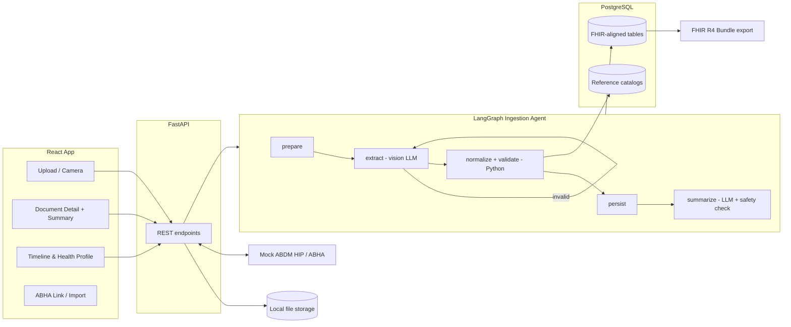

# AI-Powered Personal Health Copilot — Prototype Implementation Plan

**Stack:** LangChain + LangGraph agent · FastAPI · PostgreSQL · React
**Scope:** Round 1 brief only. That means the core scope (upload → extraction → plain-language summary → unified profile and timeline) plus the two bonuses (multilingual, ABDM/ABHA readiness).

---

## 0. Guiding Principles

1. **LLM only where judgment is needed.** The LLM reads documents and writes plain-language explanations. Everything that must be exactly right is plain Python:
   - abnormal flags
   - unit conversion
   - test-name mapping
   - dose parsing

   This is cheaper, testable, and the strongest answer to "how do you avoid misleading medical output?"
2. **One extraction call per document.** A vision-capable LLM with structured output reads printed, bilingual and handwritten documents directly. Don't add a separate OCR engine unless the evaluation set (§12) shows the model failing on a document type.
3. **FHIR-aligned from day one.** Tables are shaped after FHIR R4 resources, and thin serializers produce FHIR JSON. That gives you ABDM readiness without storing raw FHIR.
4. **One datastore.** PostgreSQL for data, local disk for uploaded files. Nothing else.
5. **One agent.** A LangGraph ingestion graph is the AI agent: it processes each document from upload to summary.

---

## 1. Tech Stack

| Layer | Choice | Why |
|---|---|---|
| Backend | Python 3.12, FastAPI, SQLAlchemy 2.0, Pydantic v2 | Fast to build, async, typed |
| Agent | `langchain`, `langgraph` | Ingestion graph and model abstraction |
| LLM | One vision-capable model with reliable structured output, via `init_chat_model` | Swap providers with one config line |
| PDF / images | PyMuPDF (`pymupdf`), Pillow | Render pages, read the PDF text layer |
| Fuzzy matching | `rapidfuzz` | Lab test aliases, medicine brand names, patient-name check |
| Auth | `pyjwt` + `passlib[bcrypt]` | Minimal email/password JWT |
| DB | PostgreSQL 16 (Docker) | Relational data + JSONB |
| Frontend | React + Vite + TypeScript + Tailwind | Fast, good UX |
| i18n | `react-i18next` (en, hi + one more, e.g. te/ta) | UI strings |

**Day-1 model choice:** run 5 sample documents (one handwritten, one bilingual, one multi-page lab report) through 2 candidate vision models. Pick by measured accuracy, not reputation.

---

## 2. Architecture



Re-draw this in Excalidraw or draw.io for the architecture deliverable.

---

## 3. Project Structure

```
health-copilot/
├── docker-compose.yml            # postgres only
├── backend/
│   ├── app/
│   │   ├── main.py
│   │   ├── config.py             # model names, DB URL
│   │   ├── db.py                 # engine, session, create_all
│   │   ├── models.py             # tables (§4)
│   │   ├── auth.py
│   │   ├── routers/              # documents, profile, timeline, abha
│   │   ├── ingestion/
│   │   │   ├── graph.py          # LangGraph wiring (§6)
│   │   │   ├── schemas.py        # Pydantic extraction schema
│   │   │   ├── prompts.py
│   │   │   ├── prepare.py
│   │   │   ├── normalize.py
│   │   │   └── summarize.py
│   │   ├── rules/                # pure Python, unit-tested
│   │   │   ├── lab_catalog.py
│   │   │   ├── formulary.py
│   │   │   ├── dosage.py
│   │   │   └── safety_text.py
│   │   └── fhir/
│   │       ├── serialize.py      # rows -> FHIR R4 Bundle
│   │       └── importer.py       # FHIR Bundle -> rows (ABHA import)
│   ├── data/                     # reference CSVs (§5) + mock ABDM bundles
│   ├── eval/                     # gold set + run_eval.py (§12)
│   └── tests/                    # rules + FHIR only
└── frontend/
    └── src/
        ├── pages/
        ├── components/           # Timeline, SummaryCard, AbnormalCard, UploadZone
        ├── api.ts
        └── i18n/                 # en.json, hi.json, te.json
```

Tests cover only `rules/` and `fhir/`. Those are the parts where a silent bug produces a wrong medical statement or invalid FHIR.

---

## 4. Data Model (FHIR-aligned)

Decide this first, because every screen reads from it.

| Table | Key columns | FHIR resource |
|---|---|---|
| `users` | id, email, password_hash, preferred_language | — |
| `profiles` | id, user_id, name, dob, sex, abha_number, abha_address, abha_linked_at | `Patient` |
| `documents` | id, profile_id, file_path, mime, doc_type, doc_date, facility, practitioner, admission_date, discharge_date, status (`processing` \| `done` \| `failed`), extraction (JSONB), summary (JSONB), summary_i18n (JSONB `{lang: summary}`), source (`upload` \| `abdm`) | `DocumentReference` + `Composition` |
| `observations` | id, profile_id, document_id, loinc_code, display_name, value_num, value_text, unit, ref_low, ref_high, interpretation (`N` `L` `H` `LL` `HH`), effective_at, confidence | `Observation` |
| `medications` | id, profile_id, document_id, brand_name, salt, strength, form, dose_pattern, per_day, timing, duration_days, start_date, end_date, prescriber, confidence | `MedicationRequest` |
| `conditions` | id, profile_id, document_id, name, icd10_code, recorded_at | `Condition` |
| `allergies` | id, profile_id, document_id, substance, reaction | `AllergyIntolerance` |

**Notes:**
- One profile per user.
- There is no `encounters` table. The serializer derives an `Encounter` from discharge-summary dates.
- A medicine is "current" when `end_date` is null or ≥ today. This is computed, not stored.
- Use `create_all` on startup. Skip Alembic for the prototype.

**ABDM document-type mapping** (the `Composition` type in exports, using NRCeS/ABDM profile names):

| `doc_type` | ABDM record type |
|---|---|
| prescription | PrescriptionRecord |
| lab_report | DiagnosticReportRecord |
| diagnostic_report (imaging) | DiagnosticReportRecord |
| discharge_summary | DischargeSummaryRecord |
| other | HealthDocumentRecord |

---

## 5. Reference Data

These are small curated CSV files in `backend/data/`, loaded at startup. They drive accuracy more than any prompt does. **Have a doctor or medical student review them.** It's cheap, and it gives you a strong Healthcare Impact talking point.

**`lab_catalog.csv` (~50 common tests)**

Columns:
- `loinc`, `canonical_name`, `aliases` (pipe-separated: `HbA1c|Glycated Hb|A1C`)
- `canonical_unit`, `unit_factors` (e.g. `mmol/L:18.0` for glucose)
- `ref_low_m`, `ref_high_m`, `ref_low_f`, `ref_high_f`
- `critical_low`, `critical_high`
- `plausible_min`, `plausible_max`
- `explainer` (one clinician-reviewed plain sentence on what the test measures)

Example LOINC codes: HbA1c `4548-4`, Haemoglobin `718-7`, TSH `3016-3`, Creatinine `2160-0`, Fasting glucose `1558-6`.

**`formulary.csv` (~200 common Indian brands)**

Columns: `brand`, `salts`, `strength`, `form`.

This is used only to correct and confirm medicine names read from prescriptions. It matters most for handwritten ones.

**`dosage_terms.json`**

Maps prescription shorthand to a structured schedule (§6.3).

---

## 6. The Ingestion Agent (LangGraph)

One run per uploaded document.

### 6.1 State

Store **file paths, not base64 images**, to keep state small.

```python
class IngestState(TypedDict):
    document_id: int
    profile_id: int
    page_paths: list[str]
    text_layer: str
    extraction: dict | None     # DocumentExtraction.model_dump()
    record: dict | None         # normalized record
    attempts: int
    error: str | None
    warnings: list[str]
```

### 6.2 Wiring

```python
g = StateGraph(IngestState)
for name, fn in {"prepare": prepare, "extract": extract, "normalize": normalize,
                 "persist": persist, "summarize": summarize, "fail": fail}.items():
    g.add_node(name, fn)

g.add_edge(START, "prepare")
g.add_edge("prepare", "extract")
g.add_conditional_edges("extract", lambda s: "normalize" if s["extraction"]
                        else ("extract" if s["attempts"] < 2 else "fail"))
g.add_edge("normalize", "persist")
g.add_edge("persist", "summarize")
g.add_edge("summarize", END)
g.add_edge("fail", END)

ingest_graph = g.compile()
```

**Running it:**
1. `POST /documents` saves the file and inserts a row with status `processing`.
2. It calls `ingest_graph.ainvoke(...)` in FastAPI `BackgroundTasks`.
3. The frontend polls `GET /documents/{id}` every 2 seconds.

### 6.3 Nodes

**`prepare`** (Python)
- **PDF:** read the text layer per page with PyMuPDF (digital PDFs have one, which is a big accuracy boost). Render pages to PNG at 150–200 DPI, max 10 pages.
- **Image:** fix EXIF rotation and downscale so the longest edge is ≤ 2048 px.
- Save pages under `storage/{document_id}/` and return their paths.

**`extract`** (one vision LLM call)

```python
extractor = init_chat_model(settings.VISION_MODEL, temperature=0) \
              .with_structured_output(DocumentExtraction)

def extract(state):
    content = [{"type": "text", "text": EXTRACT_PROMPT.format(text_layer=state["text_layer"] or "none")}]
    content += [image_block(p) for p in state["page_paths"]]   # LangChain standard image content block
    try:
        result = extractor.invoke([HumanMessage(content=content)]).model_dump()
        return {"extraction": result, "attempts": state["attempts"] + 1}
    except ValidationError as e:
        return {"extraction": None, "attempts": state["attempts"] + 1, "error": str(e)}
```

Schema (`schemas.py`). Every item carries `source_text` and `confidence`:

```python
class Medication(BaseModel):
    name: str; strength: str | None; form: str | None
    dose_pattern: str | None     # exactly as written: "1-0-1", "BD", "सुबह-शाम"
    timing: str | None           # "after food"
    duration: str | None         # "5 days", "continue"
    source_text: str; confidence: float = Field(ge=0, le=1)

class LabResult(BaseModel):
    test_name: str; value: str   # string: "<0.5", "Positive", "7.8"
    unit: str | None; ref_range: str | None; flag_on_report: str | None
    source_text: str; confidence: float = Field(ge=0, le=1)

class Diagnosis(BaseModel):
    name: str; source_text: str; confidence: float = Field(ge=0, le=1)

class DocumentExtraction(BaseModel):
    doc_type: Literal["prescription", "lab_report", "discharge_summary",
                      "diagnostic_report", "other"]
    doc_date: str | None; patient_name: str | None
    facility: str | None; practitioner: str | None
    admission_date: str | None; discharge_date: str | None
    diagnoses: list[Diagnosis]; medications: list[Medication]
    lab_results: list[LabResult]; allergies: list[str]
    impression: str | None       # imaging findings
    follow_up: str | None
    languages_detected: list[str]; handwritten: bool
```

`EXTRACT_PROMPT` rules:
- Transcribe only what is visible. Never infer.
- Use `null` for unreadable fields and lower `confidence`.
- `source_text` must be verbatim, in its original script.
- Keep original units.
- Dates in ISO format. Indian documents use `DD/MM/YYYY`.
- Treat the provided text layer as ground truth for printed text.
- Handle Hindi and other regional scripts, and mixed-language documents.

After 2 failed attempts, `fail` sets status to `failed`. The UI then shows "Couldn't read this document — try a clearer photo".

**`normalize`** (pure Python, the accuracy layer)

| Step | How |
|---|---|
| Lab name → LOINC | Exact alias match, then `rapidfuzz` (score ≥ 88). Unmapped tests are kept and displayed, but get no catalog explanation. |
| Value parse | Float when numeric. `<0.5`, `Positive` and similar stay as `value_text`. |
| Units | Convert to `canonical_unit`. The original stays in `extraction`. |
| Reference range | The range printed on the report first (labs differ), then the catalog range by sex. |
| Interpretation | **Computed by code:** `L` / `N` / `H`, and `LL` / `HH` beyond critical thresholds. The LLM never decides abnormality. |
| Plausibility | A value outside `plausible_min`/`plausible_max` gets no interpretation and is marked "check original report". It's probably a misread. |
| Brand → salt | Formulary lookup with `rapidfuzz` ≥ 85. If matched, the name is corrected to the formulary spelling. |
| Dose pattern | `dosage.py`: `1-0-1` → 2/day (morning, night); `1-1-1` / `TDS` → 3/day; `OD` → 1; `BD` → 2; `QID` → 4; `HS` → night; `SOS` / `PRN` → as needed. Also Hindi terms such as सुबह, शाम, रात, खाने के बाद, and half tablets (`½`). |
| Duration | `5 days` / `2 weeks` / `1 month` → `duration_days` → `end_date`; `continue` → open-ended. |
| Dates | Must not be in the future or before the DOB. Otherwise add a warning. |
| Patient check | Fuzzy-match `patient_name` to the profile. On mismatch, warn: "This report seems to be for *X*." |

**`persist`:** write the document metadata, `observations`, `medications`, `conditions` and `allergies` in one transaction.

**`summarize`:** see §7.2.

---

## 7. Core Features

### 7.1 Upload Flow
- Drag-and-drop or multi-file picker. On mobile, use `<input type="file" accept="image/*,application/pdf" capture="environment">` for the camera.
- Show per-file status chips: *Reading → Done / Failed*.
- Accept JPG, PNG and PDF up to 15 MB, validated on the client and the server.

### 7.2 Plain-Language Summary

**Input:** the **normalized record** with code-computed flags and catalog explainers, not the raw image.

**Output** (structured):

```json
{
  "headline": "...",
  "key_points": ["..."],
  "abnormal_explanations": [
    {"test": "HbA1c", "value": "7.8 %", "status": "High",
     "what_it_means": "...", "common_reasons": "...", "question_for_doctor": "..."}
  ],
  "medicines_explained": [
    {"name": "...", "general_purpose": "...", "how_to_take": "..."}
  ],
  "next_steps": ["..."]
}
```

Safety rules:
- The LLM **explains** the abnormal values it is given. It never decides them.
- **Critical values** (`LL`/`HH`) skip the LLM and show a fixed message: *"This value is far outside the usual range. Please contact a doctor promptly."*
- `safety_text.check()` scans the output for banned patterns: *"you have [disease]"*, *"stop taking"*, *"increase/decrease your dose"*, *"no need to see a doctor"*, *"cure"*, and similar. On a hit, regenerate once, then fall back to a template summary built from the record.
- The disclaimer is fixed text added by the UI, not by the LLM.

### 7.3 Unified Health Profile and Timeline

**Profile header:** name, age, ABHA status, conditions, allergies, current medicines, and the latest abnormal results.

**Timeline:** `GET /profile/timeline?types=&from=&to=` returns one merged, date-sorted list:
- documents
- abnormal results
- medicines started or ended
- diagnoses

It's shown as a vertical timeline grouped by month, with filter chips (Reports / Medicines / Diagnoses). Every item opens its source document.

**Document detail:**
- summary, with abnormal values in coloured cards showing a High/Low label (never colour alone)
- extracted data tables
- the original file

---

## 8. Safety Layer

| Risk | Mitigation |
|---|---|
| Hallucinated values | Verbatim `source_text` required; plausibility bounds |
| Wrong abnormal flag | Computed by code from the report's own range or the reviewed catalog |
| Misleading wording | Banned-phrase checker with template fallback; no dose or diagnosis statements |
| Critical values | Fixed urgent message, never LLM-worded |
| Wrong patient | Name check at upload |
| Privacy | JWT auth; profile delete removes files and rows; **synthetic or de-identified demo data only** |

A footer disclaimer appears on every summary: *"This app helps you understand your records. It does not provide diagnosis or treatment. Always consult a qualified doctor."*

---

## 9. Multilingual Summary (Bonus)

| Layer | How |
|---|---|
| Bilingual or handwritten OCR | Vision model prompt handles regional scripts; `source_text` kept in its original script; `dosage.py` parses Hindi dose terms |
| UI | `react-i18next` with en, hi and one South Indian language |
| Summaries | English generated at ingestion. Other languages are translated on demand when the user toggles, then cached in `summary_i18n`. The translation prompt keeps medicine names, numbers, units and test names unchanged and uses simple everyday words. |

---

## 10. ABDM / ABHA Readiness (Bonus)

1. **Link ABHA:** the user enters a 14-digit ABHA number (`XX-XXXX-XXXX-XXXX`) or an ABHA address (`name@sbx`). Format is validated, then a mock OTP step follows (demo OTP shown on screen). The ABHA details are saved on the profile.
2. **Import:** **Fetch from linked facilities** calls the mock HIP, which returns a canned FHIR Bundle from `data/mock_abdm/` (one DiagnosticReportRecord and one PrescriptionRecord). `fhir/importer.py` maps it to tables with `source=abdm`, and the records appear on the timeline with an "ABDM" badge.
3. **Export:** `GET /profile/fhir` returns a FHIR R4 Bundle from `fhir/serialize.py` with these resources:
   - `Patient`
   - `Composition` per document, typed per §4
   - `Observation` with LOINC codes
   - `MedicationRequest`
   - `Condition`
   - `AllergyIntolerance`
   - `Encounter` for discharges
4. **Validation:** one test validates the export with the `fhir.resources` library (R4B models).

In the slides, state: *"Real integration needs ABDM sandbox registration. Our schema is built to plug into it."*

---

## 11. API Endpoints

| Method | Path | Purpose |
|---|---|---|
| POST | `/auth/register`, `/auth/login` | JWT |
| GET/PUT | `/profile` | Health profile |
| POST | `/documents` | Upload; starts ingestion |
| GET | `/documents`, `/documents/{id}` | List; status, extraction, summary |
| GET | `/documents/{id}/summary?lang=hi` | Translated summary (cached) |
| GET | `/profile/timeline` | Unified timeline |
| POST | `/abha/link`, `/abha/verify`, `/abha/import` | Mock ABHA |
| GET | `/profile/fhir` | FHIR Bundle export |

## Frontend Screens
1. Login
2. Home / health profile, with a large **Upload** button
3. Upload
4. Document detail (summary with language toggle, extracted data, original)
5. Timeline
6. ABHA link / import / export

---

## 12. Evaluation (for the 35% AI Utilization score)

1. Build a **gold set of 20–30 synthetic or de-identified documents**:
   - printed lab reports in 3+ formats
   - typed prescriptions
   - 5+ handwritten prescriptions
   - 3+ bilingual documents
   - 2 discharge summaries
   - 2 imaging reports
2. Hand-label each one in the `DocumentExtraction` format.
3. `eval/run_eval.py` runs `prepare → extract → normalize` and reports field-level accuracy for:
   - medicine name, strength, dose pattern, duration
   - lab test, value, unit
   - date and doc type

   Break the results down by printed / handwritten / bilingual.
4. Run `safety_text.check()` over all summaries and report violations (target: 0).

Put the results table on a slide. It's hard evidence of extraction accuracy.

---

## 13. Build Order

| Phase | Deliverable |
|---|---|
| **1. Foundation** | Docker Postgres, models, auth, upload endpoint, model bake-off on 5 docs, reference CSVs started |
| **2. Pipeline** | `prepare → extract → normalize → persist`, status polling, document detail page |
| **3. Summary** | `summarize` with safety checks, abnormal-value cards |
| **4. Profile + timeline** | Timeline endpoint and page, profile header |
| **5. Multilingual** | i18n UI strings, on-demand summary translation |
| **6. ABDM** | FHIR serializer and importer, mock ABHA link and import, export, validation test |
| **7. Polish** | Eval run, architecture diagram, slides, demo recording |

**Suggested split for a team of 4:**
- **A:** backend and data model
- **B:** ingestion agent
- **C:** frontend
- **D:** reference data, evaluation set and slides

---

## 14. Demo Script (~3 minutes)

1. **Upload** a handwritten bilingual prescription and a lab report from a phone camera. Show the extracted medicines, dosages, values and dates.
2. **Summary** in English, then switch to Hindi. Abnormal values are explained in plain words with a question for the doctor.
3. **Timeline:** all documents, diagnoses and medicines in one place, each linked to its source.
4. **ABHA:** link a mock ABHA, import records (they appear on the timeline), export the FHIR Bundle.
5. **Close** on the evaluation results slide and the architecture diagram.

---

## 15. Deliberately Not Building

These add complexity without adding Round 1 points:
- microservices, queues, Kubernetes
- a separate OCR engine or a custom-trained model
- real ABDM gateway integration
- a native mobile app
- a vector database
